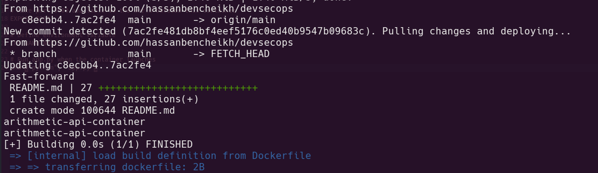

## Hassan Bencheikh
## Joudar Houssam

# DevSecOps Lab 1: Arithmetic API with Docker & CI/CD Pipeline

A complete DevSecOps implementation featuring a Python Flask API for arithmetic operations with Docker containerization, automated monitoring, and CI/CD pipeline integration with Docker Hub.

## DevOps Pipeline
- 🐳 **Docker containerization** with automated builds
- 📊 **Git repository monitoring** for new commits
- 🔄 **Automatic rebuild and deployment** on code changes
- 🚀 **Docker Hub integration** with image pushing
- 📝 **Comprehensive logging and error handling**
- ⚡ **60-second polling interval** for continuous monitoring

## 📁 Project Structure

### Endpoints

| Method | Endpoint | Parameters | Description | Example |
|--------|----------|------------|-------------|---------|
| GET | `/add` | `a`, `b` (float) | Add two numbers | `?a=10&b=5` |
| GET | `/subtract` | `a`, `b` (float) | Subtract two numbers | `?a=10&b=5` |
| GET | `/multiply` | `a`, `b` (float) | Multiply two numbers | `?a=10&b=5` |
| GET | `/divide` | `a`, `b` (float) | Divide two numbers | `?a=10&b=5` |

### Example Requests

curl "http://127.0.0.1:5000/add?a=25&b=15"

Response: {"result": 40.0}

### Docker Commands:

| Command | Description |
|---------|-------------|
| `docker build -t arithmetic-api .` | Build the Docker image |
| `docker run -d --name arithmetic-api-container -p 5000:5000 arithmetic-api` | Run container in detached mode |
| `docker ps` | List running containers |
| `docker logs arithmetic-api-container` | View container logs |
| `docker stop arithmetic-api-container` | Stop the container |
| `docker rm arithmetic-api-container` | Remove the container |
| `docker exec -it arithmetic-api-container bash` | Access container shell |

## 📊 Monitoring Features

The monitoring script provides:
- ✅ Git repository change detection (compares commit hashes)
- ✅ Automatic pull of new commits
- ✅ Docker image rebuild on changes
- ✅ Container lifecycle management (stop, remove, deploy)
- ✅ Docker Hub image push automation
- ✅ 60-second polling interval
- ✅ Console logging with timestamps

## Monitor changes on the Git repository

